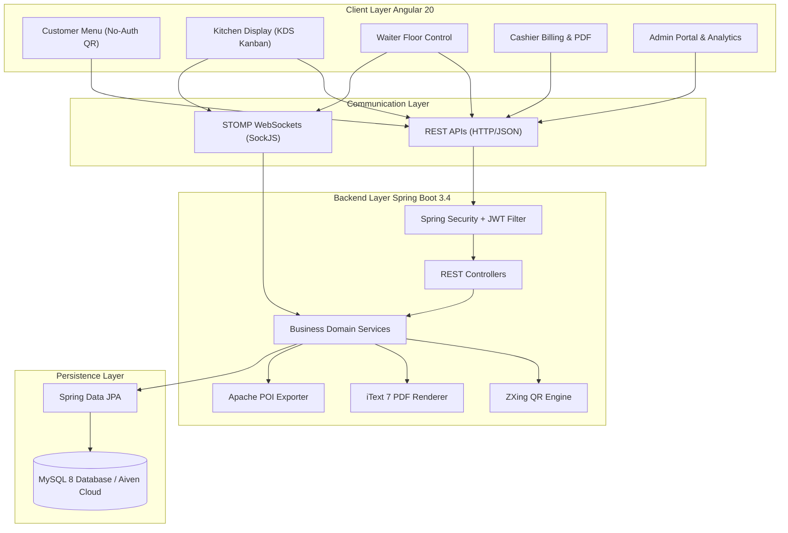
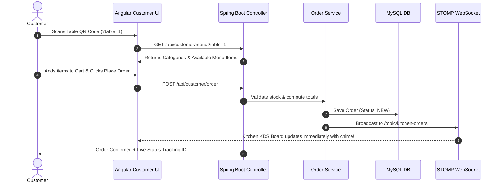
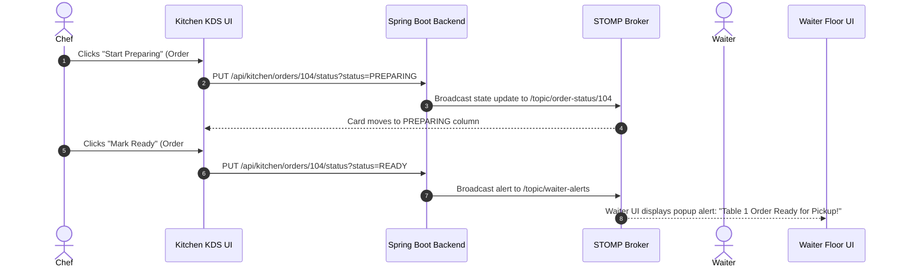

# Architecture & Technology Stack Specifications

This document outlines the system architecture, technology stack, security pipelines, and real-time data flows powering the **Cafe Management System**.

---

## 🏛️ System Architecture Overview

The system is built following an **Enterprise Multi-Tier Architecture**, separating concerns into a modern single-page frontend (Angular 20), a stateless RESTful and real-time WebSocket backend (Spring Boot 3.4.3), and a relational persistence store (MySQL 8 / Aiven Cloud).

---

## 💻 Technology Stack & Version Matrix

| Layer | Framework / Technology | Version | Purpose |
|---|---|---|---|
| **Frontend Framework** | Angular | `v20.0.0` | Standalone UI Architecture, Reactive Forms, Router |
| **Reactive State** | RxJS | `v7.8.0` | Reactive Data Streams & Event Handling |
| **Real-Time Messaging** | `@stomp/stompjs` | `v7.0.0` | Client STOMP WebSocket Protocol Handler |
| **Icons & Audio** | FontAwesome & Web Audio | `v6.5+` | UI Icons and Kitchen Order Chime Notifications |
| **Backend Framework** | Spring Boot | `v3.4.3` | Application Core, Dependency Injection, MVC |
| **Language Runtime** | Java OpenJDK | `Java 21 LTS` | Backend Language & Concurrent Runtime |
| **Security Protocol** | Spring Security + JJWT | `v0.12.5` | Stateless JWT Bearer Authentication & RBAC |
| **Persistence Engine** | Spring Data JPA (Hibernate) | `v3.4.3` | Object-Relational Mapping & Transaction Management |
| **Database Server** | MySQL Community / Aiven Cloud | `v8.0+` | Relational Storage with Foreign Keys & ACID Guarantees |
| **PDF Generation** | iText 7 Core | `v7.2.5` | Programmatic PDF Invoice Generation |
| **QR Code Engine** | Google ZXing | `v3.5.3` | QR Matrix Rendering to PNG Base64 Data URLs |
| **Excel Export** | Apache POI OOXML | `v5.2.5` | Exporting Sales Reports to `.xlsx` Format |

---

## 🔄 Real-Time & Business Data Flows

### 1. Customer Digital Order Flow (No-Auth QR)

### 2. Kitchen KDS & Waiter Real-Time Sync Flow

---

## 🔒 Security Architecture (JWT & RBAC)

1. **Stateless Authentication**:
   - Authentication requests sent to `POST /api/auth/login`.
   - Upon successful credentials verification against `users` table via `BCryptPasswordEncoder`, a signed JWT Token containing user role (`ROLE_ADMIN`, `ROLE_KITCHEN`, `ROLE_WAITER`, `ROLE_CASHIER`) and expiration timestamp (24 hours) is generated by `JwtTokenProvider`.

2. **Authorization & Request Filtering**:
   - `JwtAuthenticationFilter` intercepts incoming HTTP requests.
   - Extracts authorization header: `Authorization: Bearer <token>`.
   - Validates signature and populates `SecurityContextHolder` with `UsernamePasswordAuthenticationToken`.
   - Endpoint protection rules in `SecurityConfig`:
     - `/api/customer/**` $\rightarrow$ `PermitAll` (No login required for QR ordering)
     - `/api/admin/**` $\rightarrow$ `hasRole('ADMIN')`
     - `/api/kitchen/**` $\rightarrow$ `hasAnyRole('KITCHEN', 'ADMIN')`
     - `/api/waiter/**` $\rightarrow$ `hasAnyRole('WAITER', 'ADMIN')`
     - `/api/cashier/**` $\rightarrow$ `hasAnyRole('CASHIER', 'ADMIN')`

---

## 🖨️ Document Generation Subsystems

### 1. ZXing QR Code Generation Subsystem
- Located in `AdminService.java`.
- Takes physical table ID and generates a full URL string: `http://<host>:4200/customer/menu?table=<tableNumber>`.
- `QRCodeWriter` renders a 300x300 pixel Matrix, encoded into PNG byte array, and converted to Base64 `data:image/png;base64,...` string stored in `qr_codes` table.

### 2. iText 7 PDF Invoice Subsystem
- Located in `BillingService.java`.
- Builds a multi-section PDF document containing:
  - Cafe Header & Address Details
  - Tax Invoice Number & Timestamp
  - Table Number & Customer Profile
  - Itemized Table Grid (Item Name, Unit Price, Quantity, Subtotal)
  - Applied Coupon Discount breakdown (`WELCOME10`, `FLAT50`)
  - 5% GST Tax calculation
  - Net Payable Amount
- Output stream converted to PDF byte stream downloadable via `GET /api/cashier/invoices/{id}/pdf`.
