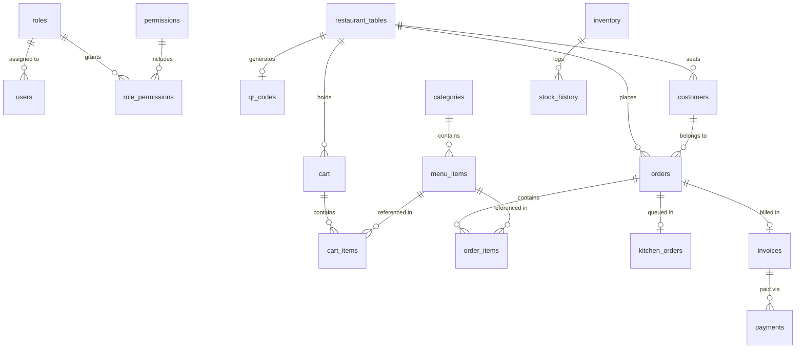

# Database Schema & Entity Relationship Specifications (MySQL 8)

This document provides complete technical documentation for the relational database schema powering the **Cafe Management System**.

---

## 📐 Entity Relationship (ER) Diagram

---

## 🗄️ Detailed Table Specifications (21 Relational Tables)

### 1. `roles`
Stores system security roles.
| Column | Type | Constraints | Description |
|---|---|---|---|
| `id` | `BIGINT` | `PRIMARY KEY, AUTO_INCREMENT` | Unique role identifier |
| `name` | `VARCHAR(50)` | `NOT NULL, UNIQUE` | Role name (`ROLE_ADMIN`, `ROLE_WAITER`, `ROLE_KITCHEN`, `ROLE_CASHIER`) |
| `description` | `VARCHAR(255)` | `NULLABLE` | Human-readable role description |

### 2. `users`
System staff credentials and assigned role.
| Column | Type | Constraints | Description |
|---|---|---|---|
| `id` | `BIGINT` | `PRIMARY KEY, AUTO_INCREMENT` | Unique user ID |
| `username` | `VARCHAR(50)` | `NOT NULL, UNIQUE` | Staff login username |
| `password` | `VARCHAR(255)` | `NOT NULL` | BCrypt encrypted password hash |
| `full_name` | `VARCHAR(100)` | `NOT NULL` | Employee full name |
| `email` | `VARCHAR(100)` | `NULLABLE, UNIQUE` | Employee email address |
| `phone` | `VARCHAR(20)` | `NULLABLE` | Employee phone number |
| `role_id` | `BIGINT` | `FOREIGN KEY (roles.id)` | Assigned security role ID |
| `is_active` | `BOOLEAN` | `DEFAULT TRUE` | Account status toggle |
| `created_at` | `TIMESTAMP` | `DEFAULT CURRENT_TIMESTAMP` | Record creation timestamp |

### 3. `permissions`
Granular feature permission definitions.
| Column | Type | Constraints | Description |
|---|---|---|---|
| `id` | `BIGINT` | `PRIMARY KEY, AUTO_INCREMENT` | Unique permission ID |
| `name` | `VARCHAR(100)` | `NOT NULL, UNIQUE` | Permission name (`MENU_WRITE`, `INVENTORY_UPDATE`) |

### 4. `role_permissions`
Join table connecting roles to permissions.
| Column | Type | Constraints | Description |
|---|---|---|---|
| `role_id` | `BIGINT` | `FOREIGN KEY (roles.id)` | Role ID |
| `permission_id` | `BIGINT` | `FOREIGN KEY (permissions.id)` | Permission ID |

### 5. `restaurant_tables`
Physical dining tables inside the cafe.
| Column | Type | Constraints | Description |
|---|---|---|---|
| `id` | `BIGINT` | `PRIMARY KEY, AUTO_INCREMENT` | Table ID |
| `table_number` | `INT` | `NOT NULL, UNIQUE` | Physical table number (e.g. 1, 2, 3) |
| `capacity` | `INT` | `NOT NULL` | Seating capacity |
| `status` | `VARCHAR(20)` | `NOT NULL, DEFAULT 'VACANT'` | Table status (`VACANT`, `OCCUPIED`, `RESERVED`) |
| `qr_token` | `VARCHAR(100)` | `NOT NULL, UNIQUE` | Unique token string encoded into table QR code |

### 6. `qr_codes`
Base64 representation of table QR code images.
| Column | Type | Constraints | Description |
|---|---|---|---|
| `id` | `BIGINT` | `PRIMARY KEY, AUTO_INCREMENT` | Record ID |
| `table_id` | `BIGINT` | `FOREIGN KEY (restaurant_tables.id)` | Foreign key referencing dining table |
| `qr_code_base64` | `LONGTEXT` | `NOT NULL` | Base64 PNG data URL string generated by ZXing |

### 7. `categories`
Food & Beverage menu categories.
| Column | Type | Constraints | Description |
|---|---|---|---|
| `id` | `BIGINT` | `PRIMARY KEY, AUTO_INCREMENT` | Category ID |
| `name` | `VARCHAR(100)` | `NOT NULL, UNIQUE` | Category name (e.g. Beverages, Desserts, Pizza) |
| `image_url` | `VARCHAR(255)` | `NULLABLE` | Display banner image URL |
| `display_order` | `INT` | `DEFAULT 0` | UI sort order |
| `is_active` | `BOOLEAN` | `DEFAULT TRUE` | Category display toggle |

### 8. `menu_items`
Digital menu items.
| Column | Type | Constraints | Description |
|---|---|---|---|
| `id` | `BIGINT` | `PRIMARY KEY, AUTO_INCREMENT` | Menu Item ID |
| `category_id` | `BIGINT` | `FOREIGN KEY (categories.id)` | Parent category ID |
| `name` | `VARCHAR(150)` | `NOT NULL` | Item title (e.g. "Espresso Single Shot") |
| `description` | `TEXT` | `NULLABLE` | Detailed description & ingredients |
| `price` | `DECIMAL(10,2)` | `NOT NULL` | Item selling price |
| `image_url` | `VARCHAR(255)` | `NULLABLE` | Item picture URL |
| `is_veg` | `BOOLEAN` | `DEFAULT TRUE` | Vegetarian status flag |
| `is_available` | `BOOLEAN` | `DEFAULT TRUE` | Live menu stock availability toggle |
| `prep_time_minutes`| `INT` | `DEFAULT 15` | Estimated preparation time in minutes |

### 9. `customers`
Guest customer session profiles.
| Column | Type | Constraints | Description |
|---|---|---|---|
| `id` | `BIGINT` | `PRIMARY KEY, AUTO_INCREMENT` | Customer ID |
| `name` | `VARCHAR(100)` | `NULLABLE` | Guest name |
| `phone` | `VARCHAR(20)` | `NULLABLE` | Contact number |
| `table_id` | `BIGINT` | `FOREIGN KEY (restaurant_tables.id)` | Table where customer is seated |
| `session_token` | `VARCHAR(100)` | `NOT NULL, UNIQUE` | Temporary browser session token |

### 10. `cart`
Active customer shopping cart.
| Column | Type | Constraints | Description |
|---|---|---|---|
| `id` | `BIGINT` | `PRIMARY KEY, AUTO_INCREMENT` | Cart ID |
| `table_id` | `BIGINT` | `FOREIGN KEY (restaurant_tables.id)` | Associated table |

### 11. `cart_items`
Individual items inside active customer cart.
| Column | Type | Constraints | Description |
|---|---|---|---|
| `id` | `BIGINT` | `PRIMARY KEY, AUTO_INCREMENT` | Cart line item ID |
| `cart_id` | `BIGINT` | `FOREIGN KEY (cart.id)` | Parent cart ID |
| `menu_item_id` | `BIGINT` | `FOREIGN KEY (menu_items.id)` | Selected menu item ID |
| `quantity` | `INT` | `NOT NULL` | Ordered quantity |
| `special_notes` | `VARCHAR(255)` | `NULLABLE` | Customization instructions (e.g. "Extra hot", "Less sugar") |

### 12. `orders`
Master order records.
| Column | Type | Constraints | Description |
|---|---|---|---|
| `id` | `BIGINT` | `PRIMARY KEY, AUTO_INCREMENT` | Order ID |
| `order_number` | `VARCHAR(50)` | `NOT NULL, UNIQUE` | Display order code (e.g. "ORD-2026-104") |
| `table_id` | `BIGINT` | `FOREIGN KEY (restaurant_tables.id)` | Dining table ID |
| `customer_id` | `BIGINT` | `FOREIGN KEY (customers.id)` | Customer ID |
| `subtotal` | `DECIMAL(10,2)` | `NOT NULL` | Items price sum |
| `discount_amount` | `DECIMAL(10,2)` | `DEFAULT 0.00` | Applied coupon discount value |
| `tax_amount` | `DECIMAL(10,2)` | `DEFAULT 0.00` | Computed 5% GST tax |
| `total_amount` | `DECIMAL(10,2)` | `NOT NULL` | Final payable total |
| `order_status` | `VARCHAR(30)` | `NOT NULL, DEFAULT 'NEW'`| Status (`NEW`, `PREPARING`, `READY`, `SERVED`, `PAID`) |
| `created_at` | `TIMESTAMP` | `DEFAULT CURRENT_TIMESTAMP` | Order timestamp |

### 13. `order_items`
Snapshot line items contained within an order.
| Column | Type | Constraints | Description |
|---|---|---|---|
| `id` | `BIGINT` | `PRIMARY KEY, AUTO_INCREMENT` | Order item ID |
| `order_id` | `BIGINT` | `FOREIGN KEY (orders.id)` | Master order ID |
| `menu_item_id` | `BIGINT` | `FOREIGN KEY (menu_items.id)` | Menu item ID |
| `quantity` | `INT` | `NOT NULL` | Quantity ordered |
| `unit_price` | `DECIMAL(10,2)` | `NOT NULL` | Historical item price snapshot at time of purchase |
| `subtotal` | `DECIMAL(10,2)` | `NOT NULL` | Line item total (`quantity * unit_price`) |
| `special_notes` | `VARCHAR(255)` | `NULLABLE` | Customer customization instructions |

### 14. `kitchen_orders`
Active KDS kitchen queue table.
| Column | Type | Constraints | Description |
|---|---|---|---|
| `id` | `BIGINT` | `PRIMARY KEY, AUTO_INCREMENT` | KDS Queue ID |
| `order_id` | `BIGINT` | `FOREIGN KEY (orders.id)` | Reference to master order |
| `started_at` | `TIMESTAMP` | `NULLABLE` | Timestamp when chef moved order to PREPARING |
| `completed_at` | `TIMESTAMP` | `NULLABLE` | Timestamp when chef moved order to READY |

### 15. `coupons`
Promotional discount coupons.
| Column | Type | Constraints | Description |
|---|---|---|---|
| `id` | `BIGINT` | `PRIMARY KEY, AUTO_INCREMENT` | Coupon ID |
| `code` | `VARCHAR(50)` | `NOT NULL, UNIQUE` | Coupon promo code (e.g. `WELCOME10`, `FLAT50`) |
| `discount_type` | `VARCHAR(20)` | `NOT NULL` | Discount type (`PERCENTAGE`, `FLAT`) |
| `discount_value`| `DECIMAL(10,2)` | `NOT NULL` | Percentage value or Flat rupee amount |
| `min_order_amount`|`DECIMAL(10,2)`| `DEFAULT 0.00` | Minimum order value threshold to redeem |
| `is_active` | `BOOLEAN` | `DEFAULT TRUE` | Coupon validity status |

### 16. `invoices`
Financial tax invoice records.
| Column | Type | Constraints | Description |
|---|---|---|---|
| `id` | `BIGINT` | `PRIMARY KEY, AUTO_INCREMENT` | Invoice ID |
| `invoice_number` | `VARCHAR(50)` | `NOT NULL, UNIQUE` | Invoice reference string (e.g. "INV-2026-0089") |
| `order_id` | `BIGINT` | `FOREIGN KEY (orders.id)` | Billed order reference ID |
| `subtotal` | `DECIMAL(10,2)` | `NOT NULL` | Order subtotal |
| `discount_amount` | `DECIMAL(10,2)` | `DEFAULT 0.00` | Applied discount |
| `tax` | `DECIMAL(10,2)` | `NOT NULL` | GST tax amount |
| `total_amount` | `DECIMAL(10,2)` | `NOT NULL` | Net invoice total payable |
| `payment_status` | `VARCHAR(20)` | `DEFAULT 'PENDING'` | Invoice payment state (`PENDING`, `PAID`) |
| `created_at` | `TIMESTAMP` | `DEFAULT CURRENT_TIMESTAMP` | Invoice issue timestamp |

### 17. `payments`
Payment transaction records.
| Column | Type | Constraints | Description |
|---|---|---|---|
| `id` | `BIGINT` | `PRIMARY KEY, AUTO_INCREMENT` | Payment ID |
| `invoice_id` | `BIGINT` | `FOREIGN KEY (invoices.id)` | Billed invoice ID |
| `payment_method` | `VARCHAR(20)` | `NOT NULL` | Payment mode (`CASH`, `CARD`, `UPI`) |
| `amount` | `DECIMAL(10,2)` | `NOT NULL` | Paid amount |
| `transaction_id` | `VARCHAR(100)` | `NULLABLE` | UPI/Card transaction reference string |
| `payment_status` | `VARCHAR(20)` | `NOT NULL` | Transaction result (`COMPLETED`, `FAILED`) |
| `paid_at` | `TIMESTAMP` | `DEFAULT CURRENT_TIMESTAMP` | Timestamp of payment completion |

### 18. `inventory`
Raw ingredient inventory tracking.
| Column | Type | Constraints | Description |
|---|---|---|---|
| `id` | `BIGINT` | `PRIMARY KEY, AUTO_INCREMENT` | Inventory Item ID |
| `item_name` | `VARCHAR(100)` | `NOT NULL, UNIQUE` | Raw ingredient name (e.g. Coffee Beans, Whole Milk) |
| `quantity` | `DECIMAL(10,2)` | `NOT NULL` | Current stock on hand |
| `unit` | `VARCHAR(20)` | `NOT NULL` | Unit of measure (`kg`, `liters`, `units`) |
| `min_threshold` | `DECIMAL(10,2)` | `NOT NULL` | Low stock alert trigger quantity |

### 19. `stock_history`
Audit trail of inventory movements.
| Column | Type | Constraints | Description |
|---|---|---|---|
| `id` | `BIGINT` | `PRIMARY KEY, AUTO_INCREMENT` | Audit ID |
| `inventory_id` | `BIGINT` | `FOREIGN KEY (inventory.id)` | Inventory item reference |
| `change_amount` | `DECIMAL(10,2)` | `NOT NULL` | Stock quantity added (+) or used (-) |
| `reason` | `VARCHAR(255)` | `NOT NULL` | Stock adjustment reason |
| `created_at` | `TIMESTAMP` | `DEFAULT CURRENT_TIMESTAMP` | Audit entry timestamp |

### 20. `notifications`
Real-time STOMP notification archive.
| Column | Type | Constraints | Description |
|---|---|---|---|
| `id` | `BIGINT` | `PRIMARY KEY, AUTO_INCREMENT` | Notification ID |
| `target_role` | `VARCHAR(50)` | `NOT NULL` | Intended recipient role (`ROLE_WAITER`, `ROLE_KITCHEN`) |
| `message` | `VARCHAR(255)` | `NOT NULL` | Alert body text |
| `is_read` | `BOOLEAN` | `DEFAULT FALSE` | Read receipt toggle |
| `created_at` | `TIMESTAMP` | `DEFAULT CURRENT_TIMESTAMP` | Message timestamp |

### 21. `audit_logs`
Security and system operational audit trail.
| Column | Type | Constraints | Description |
|---|---|---|---|
| `id` | `BIGINT` | `PRIMARY KEY, AUTO_INCREMENT` | Log ID |
| `username` | `VARCHAR(50)` | `NOT NULL` | Staff user responsible for action |
| `action` | `VARCHAR(100)` | `NOT NULL` | Operation description (e.g. "MENU_ITEM_DELETED") |
| `ip_address` | `VARCHAR(45)` | `NULLABLE` | Client IP address |
| `timestamp` | `TIMESTAMP` | `DEFAULT CURRENT_TIMESTAMP` | Operation timestamp |
