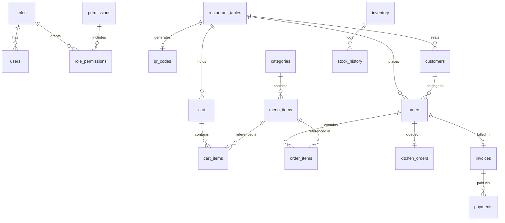

# Database Design & Entity Relationship (ER) Specs

This document details the normalized relational database design (MySQL 8) for the **Cafe Management System**.

## ER Diagram Representation

## Summary of 21 Tables

1. `roles`: Master user roles (`ROLE_ADMIN`, `ROLE_WAITER`, `ROLE_KITCHEN`, `ROLE_CASHIER`).
2. `users`: System staff credentials with BCrypt password hashes.
3. `permissions`: Granular RBAC feature permissions.
4. `role_permissions`: Join table linking roles to permissions.
5. `restaurant_tables`: Physical table numbers, capacities, status, and QR tokens.
6. `qr_codes`: Generated ZXing Base64 QR code representations for tables.
7. `categories`: Digital menu categories with display order & images.
8. `menu_items`: Food & beverage items, prices, prep times, veg/non-veg status.
9. `customers`: Session-bound guest customer profiles.
10. `cart`: Active customer shopping carts.
11. `cart_items`: Menu items in customer cart with custom notes.
12. `orders`: Master order records, subtotal, discount, GST tax, status (`NEW`, `PREPARING`, `READY`, `SERVED`, `PAID`).
13. `order_items`: Specific line items in an order.
14. `kitchen_orders`: Live kitchen queue tracking estimated preparation time and completion.
15. `coupons`: Promotional discount coupons (Percentage or Flat).
16. `invoices`: Financial invoices with calculated subtotal, GST, and total payable.
17. `payments`: Payment records (`CASH`, `CARD`, `UPI`).
18. `inventory`: Raw ingredient stock levels & minimum required alert thresholds.
19. `stock_history`: Audit trail for stock additions, usage, and adjustments.
20. `notifications`: Role-targeted STOMP WebSocket notification log.
21. `audit_logs`: Detailed system security audit trail.
