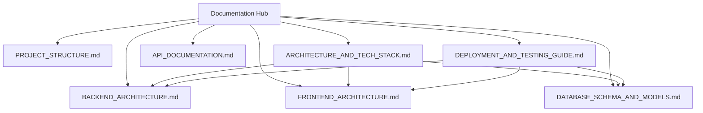

# Cafe Management System - Comprehensive Documentation Portal

Welcome to the central documentation hub for the **Enterprise Full-Stack Cafe Management System**. This documentation suite provides an in-depth breakdown of the project architecture, detailed directory structure, database design, backend/frontend engineering specifications, REST & WebSocket API endpoints, and deployment guidelines.

---

## 📚 Documentation Index

| Module / Topic | File Link | Description |
|---|---|---|
| 📁 **Complete Project Structure** | [PROJECT_STRUCTURE.md](file:///c:/Users/mohan/Cafe%20Management/documentation/PROJECT_STRUCTURE.md) | Comprehensive tree view and file-by-file breakdown of every package, component, entity, route, and script. |
| 🏗️ **Architecture & Tech Stack** | [ARCHITECTURE_AND_TECH_STACK.md](file:///c:/Users/mohan/Cafe%20Management/documentation/ARCHITECTURE_AND_TECH_STACK.md) | High-level system architecture, layer diagrams, technology stack versions, security mechanics, and live WebSockets. |
| ☕ **Backend Architecture** | [BACKEND_ARCHITECTURE.md](file:///c:/Users/mohan/Cafe%20Management/documentation/BACKEND_ARCHITECTURE.md) | Detailed Spring Boot (Java 21) package layout, controllers, services, repositories, security filters, DTOs, and exception handling. |
| 🅰️ **Frontend Architecture** | [FRONTEND_ARCHITECTURE.md](file:///c:/Users/mohan/Cafe%20Management/documentation/FRONTEND_ARCHITECTURE.md) | Angular 20 Standalone architecture, features (Customer, Kitchen, Waiter, Cashier, Admin), RxJS services, HTTP interceptors, and custom CSS design system. |
| 🗄️ **Database Schema & Models** | [DATABASE_SCHEMA_AND_MODELS.md](file:///c:/Users/mohan/Cafe%20Management/documentation/DATABASE_SCHEMA_AND_MODELS.md) | Exhaustive documentation of all 21 normalized MySQL 8 tables, column data types, constraints, indexes, and Mermaid ER diagram. |
| 🔌 **API Documentation** | [API_DOCUMENTATION.md](file:///c:/Users/mohan/Cafe%20Management/documentation/API_DOCUMENTATION.md) | Complete REST API reference, request/response JSON schemas, authentication header specs, and STOMP WebSocket topics. |
| 🚀 **Deployment & Setup Guide** | [DEPLOYMENT_AND_TESTING_GUIDE.md](file:///c:/Users/mohan/Cafe%20Management/documentation/DEPLOYMENT_AND_TESTING_GUIDE.md) | Step-by-step instructions for local execution, Aiven Cloud MySQL connection, Docker deployment, and testing. |
| 🛠️ **Utility & Migration Tools** | [../tools/README.md](file:///c:/Users/mohan/Cafe%20Management/tools/README.md) | Standalone Java tools for cloud DB migration, schema verification, and iText 7 PDF rendering tests. |

---

## 🚀 Quick Navigation Matrix

---

## 🛠️ Project Summary & Tech Highlights

- **Backend**: Spring Boot 3.4.3 (Java 21 LTS), Spring Security (JWT), Spring Data JPA, Spring WebSocket (STOMP), ZXing (QR Codes), iText 7 (PDF Invoicing), Apache POI (Excel Export).
- **Frontend**: Angular 20 Standalone Components, RxJS, FontAwesome, Web Audio API, Custom Responsive CSS Design System (Glassmorphism, Dark Theme).
- **Database**: MySQL 8.0 (21 Relational Tables) with Aiven Cloud MySQL integration support.
- **Real-Time Capabilities**: WebSocket STOMP topics for instant kitchen board state synchronization and waiter notifications.
